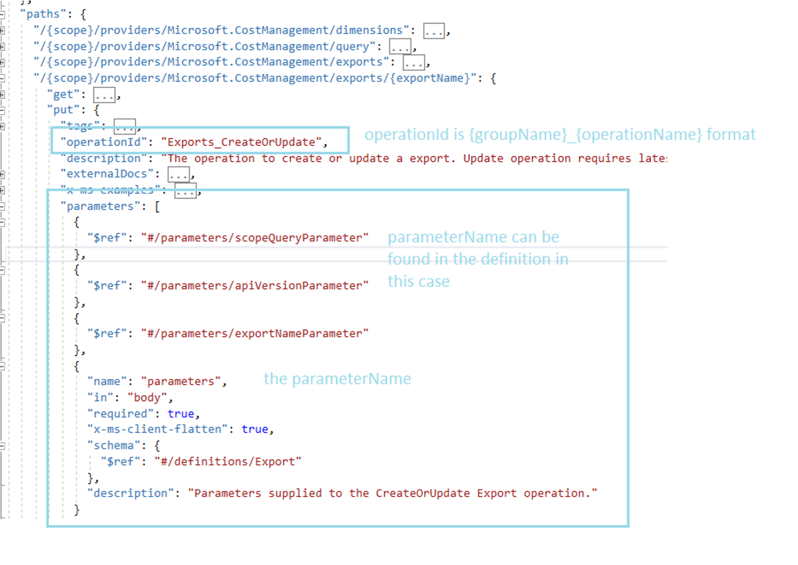
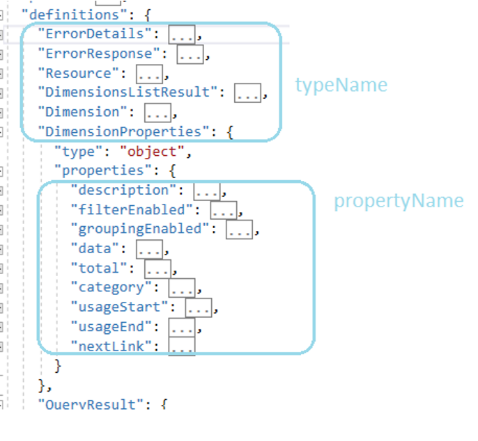

# About cli-directive

## How to figure out the name for group, operation, parameter, type and property in cli directives
For groupName, operationName, parameterName, typeName, propertyName, usually you can find them at swagger at:
* Usually the operationId is in format {groupName}_{operationName}, and the parameterName is the parameters->name

* TypeName is the name under definitions, and the propertyName is the name under properties



## Name convention used in directive

> so please make sure **snake_naming_convention** is used for 'name' and 'alias' clause in directive 
> so that the naming convention configured in clicommon can be applied correctly
> when generating the output

## Supported clause in directive
- select: 
  - the target object type of directive
  - optional (then will be figured out automatically from where clause)
  - possible value: 'operationGroup' | 'operation' | 'parameter' | 'objectSchema' | 'property' | 'choiceSchema' | 'choiceValue'
- where: 
  - conditions to locate the object to apply directive
  - required
  - regex is supported in the value
  - possible search condition, refer to sample below for more detail usage:
    - search for operatoinGroup, operation or parameter
      - 'operationGroup' | 'group' | 'resource': 'operationGroupName'
      - 'operation' | 'op': 'operationName'
      - 'parameter' | 'param': 'parameterName'
      - 'apiVersion': 'apiVersion'
    - search for schema or properties
      - 'schemaObject' | 'type' | 'object': 'schemaName'
      - 'property' | 'prop': 'propertyName'
    - search for enum or enumValue
      - 'choiceSchema' | 'enum': 'choiceName'
      - 'choiceValue' | 'value': 'choiceName'
    - search for example and path in it
      - 'exampleName'
      - 'path' | 'dotPath' | 'exampleParameterPath': 'dotPath'
- set:
  - set anything property in the selected object(s)
  - optional
- name:
  - add 'name: ...' under 'language->cli'. Please make sure **snake_naming_convention** is used
  - optional
- description:
  - add 'description: ...' under 'language->cli'.
  - optional
- default-value:
  - add 'default-value: ...' under 'language->cli'
  - optional
- hidden:
  - add 'hidden: ...' under 'language->cli'.
  - optional
- removed:
  - add 'removed: ...' under 'language->cli'.
  - optional
- required:
  - add 'required: ...' under 'language->cli'.
  - optional
- alias:
  - add 'alias: ...' under 'language->cli'.  Please make sure **snake_naming_convention** is used
  - optional
- json:
  - add 'json: ...' under 'language->cli'.
  - add 'x-ms-client-flatten: false' under 'extensions' and 'cli-flatten: false' under 'language->cli' if 'json: true'.
- flatten:
  - add 'cli-flatten: ..." under 'language->cli'
- formatTable:
  - add properties information  under 'language->cli'.
  - optional
  - value format:
    - properties:
      - prop1Name
      - prop2Name
      - ...
- replace:
  - do replacement
  - optional
  - value format:
    - field: 'name'
    - old: 'old_value'
    - new: 'new_value'
    - isRegex: true | false
- split-operation-names
  - split operation into multiple operations with given names
  - add 'split-operation-names" under 'language->cli'
  - optional
  - value format:
    - opName1
    - opName2
    - ...
- min-api:
  - add 'min-api: ..." under 'language->cli'
- max-api:
  - add 'max-api: ..." under 'language->cli'
- resource-type:
  - add 'resource-type: ..." under 'language->cli'
- value:
  - set static value for example dotPath
- eval:
  - set dynamic value for example dotPath with an evaluatable script

## How to troubleshooting
> Add --debug in your command line to have more intermedia output files for troubleshooting

## Samples

``` $(sample-cli-directive)
cli:
    cli-directive:
    # directive on operationGroup
      - select: 'operationGroup'
        where:
            operationGroup: 'OldName'
        name: 'new_name'   
        description: 'new description'
      - where:
            resource: 'OldName'
        hidden: true
      - where:
            group: 'OldName'
        removed: 'true
    # add hidden property for operation
      - where:
            group: 'GroupName'
            operation: 'OperationName'
        hidden: true
      - where:
            group: 'groupName'
            op: 'OperationName'
        hidden: true
    # add removed property for parameter
      - where:
            group: 'groupName'
            op: 'OperationName'
            parameter: 'ParameterName'
        removed: true
      - where:
            group: 'groupName'
            op: 'OperationName'
            param: 'ParameterName'
        required: true
        default-value: 'default value of the param'
    # add hidden property for all parameter start with 'abc'
      - where:
            parameter: '^abc.*$'
        hidden: true
    # set table format under for schema
      - where:
            schemaObject: 'SchemaName'
        tableFormat:
            properties:
              - 'p1'
              - 'p2'
      - where:
            type: 'SchemaName'
        tableFormat:
            properties:
              - 'p1'
              - 'p2'
      - where:
            object: 'SchemaName'
        tableFormat:
            properties:
              - 'p1'
              - 'p2'
    # set anything for schema property
      - where:
            type: 'SchemaName'
            property: 'PropertyName'
        set:
            key1: 'value1'
            key2: true
            key3:
              - v1
              - v2
      - where:
            type: 'SchemaName'
            prop: 'PropertyName'
        set:
            key1: 'value1'
            key2: true
            key3:
              - v1
              - v2
    # replac 'name_a' with 'name_b' (whole word match) in operation's name
      - where:
            group: 'GroupName'
            op: 'OperationName'
        replace:
            field: 'name'
            old: 'name_a'
            new: 'name_b'
            isRegex: false
    # replace with regex
      - where:
            group: 'GroupName'
            op: 'OperationName'
        replace:
            field: 'description'
            old: '(startByThis)(.*)'
            new: 'startByThat$2'
            isRegex: true
    # add alias for enum value
      - where:
            choiceSchema: 'choiceType'
            choiceValue: 'choiceValue'
        alias: NewAlias
      - where:
            enum: 'enumTyp'
            value: 'enumValue'
        alias: NewAlias
    # split operation into multiple operations
      - where:
          group: OperationGroupName
          op: CreateOrUpdate
        split-operation-names:
          - Create
          - Update
    # flatten parameter
      - where:
          group: OperationGroupName
          op: CreateOrUpdate#Update
          param: properties
        cli-flatten: true
    # set resource-type/max-api/min-api
      - where:
          group: OperationGroupName
          op: Delete
      - max-api: '2019-01-01'
      - max-api: '2018-01-01'
      - resource-type: 'DATA_STORAGE_BLOB'
    # set example content with static value
      - where:
          exampleName: TheExampleName
          exampleParameterPath: parameters.hostPool.location
        value: Shanghai
    # set example content with dynamic script
      - where:
          exampleName: TheExampleName
          exampleParameterPath: parameters.registration-info.expiration-time
        eval: "var d = new Date(); d.setDate(d.getDate()+15); var ye = new Intl.DateTimeFormat('en', { year: 'numeric' }).format(d); var mo = new Intl.DateTimeFormat('en', { month: '2-digit' }).format(d); var da = new Intl.DateTimeFormat('en', { day: '2-digit' }).format(d); `${ye}-${mo}-${da}T00:00:00.000Z` "

```

